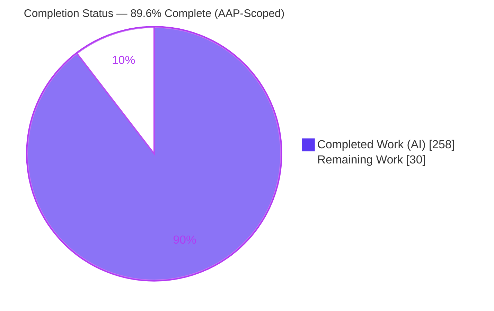
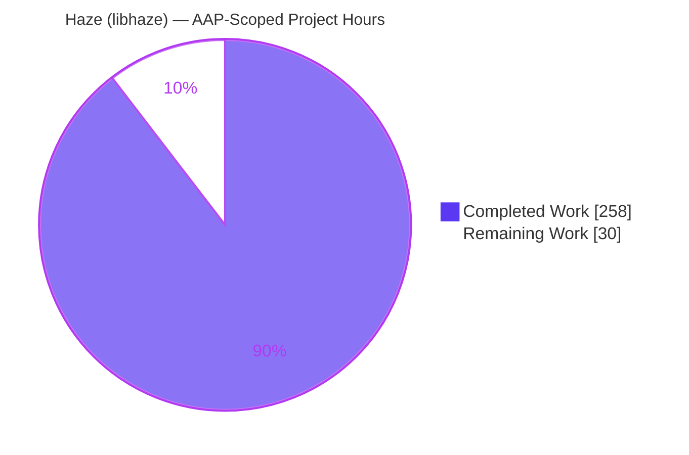
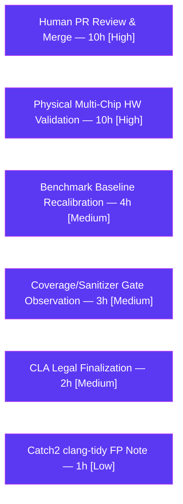

# Blitzy Project Guide — Haze (libhaze)

> C++23 record-and-replay runtime exposing a stable C ABI shaped like the CUDA runtime API for the Niobium FHE accelerator.

---

## 1. Executive Summary

### 1.1 Project Overview

Haze (`libhaze`) is a C++23 record-and-replay runtime shim that exposes a stable C ABI shaped like the CUDA runtime API to drive the Niobium FHE accelerator, sitting one layer below `niobium-client` with FIDESlib as its primary CUDA-resident consumer. This initiative advanced the library from a partially-stubbed state to a fully-realized, benchmarked, coverage-gated, and documented runtime: implementing graph capture, peer access, and performance counters; standing up Google Benchmark and Clang source-based coverage infrastructure with CI gates; backfilling and hardening the Catch2 test suite; and completing contributor and user documentation — all without altering the public C ABI, the record-and-replay architecture, the symbol-leak isolation guarantee, or the three intentional no-ops.

### 1.2 Completion Status

The project is **89.6% complete** on an AAP-scoped basis. All twelve AAP-scoped deliverables (nine work items P1a–P3b plus three Rule-mandated deliverables) are fully implemented, tested, and committed. The remaining 30 hours are exclusively path-to-production activities that are inherently human- or hardware-gated (independent code review and merge, physical multi-chip hardware validation, real-hardware benchmark baseline recalibration, CI-gate observation, and CLA legal finalization).



| Metric | Hours |
|--------|------:|
| **Total Hours** | **288** |
| Completed Hours (AI) | 258 |
| Completed Hours (Manual) | 0 |
| **Completed Hours (AI + Manual)** | **258** |
| **Remaining Hours** | **30** |
| **Percent Complete** | **89.6%** |

*Completion formula (PA1, AAP-scoped): 258 ÷ (258 + 30) × 100 = 89.6%.*

### 1.3 Key Accomplishments

- ✅ **P1a — Graph Capture:** All seven `HAZE_ERROR_NOT_SUPPORTED` stubs in `src/api/graph.cpp` replaced with a real record-once/replay-many implementation backed by a new `src/core/graph.{hpp,cpp}` module and an epoch trace-snapshot primitive (27 test cases; recapture-corruption defect fixed).
- ✅ **P1b — Benchmark Suite:** Google Benchmark harness with 10 benchmarks (add/mul/NTT/automorph in SRP+MRP plus the record→flush→replay path), a checked-in baseline, a Python regression gate, a `make bench` target, and a CI workflow.
- ✅ **P2a — Peer Access:** `hazeDeviceEnablePeerAccess`, `hazeDeviceCanAccessPeer`, and `hazeMemcpyPeerAsync` implemented for the simulator-representable topology (24 test cases); physical multi-chip steps explicitly flagged as human follow-up.
- ✅ **P2b — Performance Counters:** Additive `hazePerformanceCounters` struct (7 fields) plus a `src/core/metrics.{hpp,cpp}` aggregator fed by epoch and allocator hooks (19 test cases).
- ✅ **P2c — Coverage Gate:** Clang source-based coverage via `HAZE_COVERAGE` + `scripts/coverage.sh`, fail-closed at 80%; measured **85.85%** line coverage on `src/core/` + `src/api/`.
- ✅ **P2d / P2e — Testing:** ~23 previously-untested public API functions backfilled and nine error/edge categories hardened under ASan/UBSan/TSan; suite now spans 31 translation units.
- ✅ **P3a / P3b — Documentation:** `CONTRIBUTING.md` expanded to full guidelines with a marked CLA placeholder; new `docs/` tree and `examples/` created with the docs-as-tests guarantee preserved.
- ✅ **Rules 1–3:** Decision log (explainability), structured logging + correlation IDs + Grafana dashboard (observability), and a 16-slide self-contained reveal.js executive deck all delivered.
- ✅ **ABI & Quality:** Public C ABI preserved (symbol-leak audit green, 80 `haze*` symbols); clang-format/clang-tidy clean on first-party code; all CI workflows intact.

### 1.4 Critical Unresolved Issues

There are **no critical unresolved in-scope issues.** The Final Validator reported PRODUCTION-READY with all five production-readiness gates passed and zero in-scope defects. The items below are path-to-production activities, not defects.

| Issue | Impact | Owner | ETA |
|-------|--------|-------|-----|
| Physical multi-chip hardware validation pending for peer access (P2a) | Peer-access paths validated in simulator only; real-hardware behavior unconfirmed | Hardware/Platform team | Post-merge (hardware window) |
| Benchmark baseline captured in CI/simulator environment | Regression thresholds may need recalibration against target hardware | Performance owner | Post-merge |
| CLA text is a marked placeholder | External contributions gated until legal finalizes the agreement | Legal + Maintainers | Post-merge |

### 1.5 Access Issues

No access issues were identified that block build validation, testing, or the autonomous work delivered. All dependencies were installed and discoverable during validation (Clang 19, CMake, Ninja, Catch2 3, Google Benchmark, `llvm-cov`/`llvm-profdata`, `lcov`, and both OpenFHE builds). The one access-dependent activity is deferred by design.

| System/Resource | Type of Access | Issue Description | Resolution Status | Owner |
|-----------------|----------------|-------------------|-------------------|-------|
| Physical multi-chip Niobium hardware | Hardware lab / device access | Real multi-chip devices are absent from CI; hardware-gated peer-access tests (behind the `[.]` tag) cannot run without them | Deferred by design (AAP §0.3.2 human follow-up) | Hardware/Platform team |
| Transport target (`NIOBIUM_COMPILER_ROOT`) | External build environment | `test-transport` suite requires an external compiler root and is excluded from default/CI gates by design | Not required for this scope | Platform team |

### 1.6 Recommended Next Steps

1. **[High]** Perform independent human code review of the delivered branch and merge into `main`, confirming all CI workflows remain green post-merge.
2. **[High]** Run the hardware-gated peer-access tests on physical multi-chip hardware and document the results (explicit AAP human follow-up).
3. **[Medium]** Recapture the benchmark baseline on target hardware and tune the regression tolerance in `scripts/bench_compare.py`.
4. **[Medium]** Finalize the CLA legal text in `CONTRIBUTING.md`, replacing the marked placeholder.
5. **[Medium]** Observe the new coverage and sanitizer CI gates over real inbound PR traffic before making them required checks.

---

## 2. Project Hours Breakdown

### 2.1 Completed Work Detail

| Component | Hours | Description |
|-----------|------:|-------------|
| P1a — Graph Capture | 44 | Seven graph shims filled; new `src/core/graph.{hpp,cpp}` (400 LOC) record-once/replay-many with `GraphState`/`GraphExec`; epoch trace-snapshot primitive; CUDA-graph-semantics research; 27 tests; recapture-corruption fix. |
| P1b — Benchmark Suite | 23 | Google Benchmark harness (757 LOC, 10 benchmarks); `scripts/bench_compare.py` regression gate; `make bench`; `benchmark.yml`; `gbenchmark` flake integration. |
| P2a — Peer Access (simulator) | 22 | `hazeDeviceEnablePeerAccess`/`CanAccessPeer` + `hazeMemcpyPeerAsync`; simulator peer-topology in `src/core/device`; 24 hardware-gated tests. |
| P2b — Performance Counters | 22 | Additive `hazePerformanceCounters` struct; `src/core/metrics.{hpp,cpp}` aggregator (195 LOC); epoch/allocator hooks; getter populated; 19 tests. |
| P2c — Coverage Gate | 14 | `HAZE_COVERAGE` option; `scripts/coverage.sh` (fail-closed, 85.85%); `coverage.yml`; `llvm-cov` workflow research. |
| P2d — Test Backfill | 26 | ~23 public functions + internal modules + no-op smoke tests across 7 new TUs. |
| P2e — Error-Path Hardening | 24 | Nine error/edge categories across 5 TUs; ASan/UBSan/TSan; concurrency lock-order test. |
| P3a — CONTRIBUTING.md | 4 | Expanded from ~5 to 218 lines with a marked CLA placeholder. |
| P3b — docs/ + examples/ | 21 | `docs/` tree (index/architecture/building/testing); migrated `examples/`; docs-as-tests preserved; README sections. |
| Rule 1 — Decision Log | 10 | `docs/decision-log.md` — 22+ decision table entries, traceability matrix, and 13 logged deviations. |
| Rule 2 — Observability | 16 | Structured logging + correlation IDs (injection-safe, line-atomic); Grafana dashboard template; observability README; 7 tests. |
| Rule 3 — Executive Deck | 16 | 16-slide self-contained reveal.js deck; inline Blitzy theme; Mermaid/Lucide; gauge/contrast/offline-degradation fixes. |
| Build/CI Integration + QA/Security Remediation | 16 | CMake source/test registration; `HAZE_BUILD_BENCHMARKS` + `HAZE_COVERAGE` options; Makefile targets; flake.nix; 7-workflow SHA-pinning; SEC-01..05 remediation; 30 code-review + 15 QA findings resolved. |
| **Total Completed** | **258** | |

### 2.2 Remaining Work Detail

| Category | Hours | Priority |
|----------|------:|----------|
| Human PR Review & Merge | 10 | High |
| Physical Multi-Chip Hardware Validation (P2a follow-up) | 10 | High |
| Real-Hardware Benchmark Baseline Recalibration | 4 | Medium |
| Coverage/Sanitizer CI Gate Observation & Tuning | 3 | Medium |
| CLA Legal Finalization | 2 | Medium |
| Catch2 clang-tidy False-Positive Documentation | 1 | Low |
| **Total Remaining** | **30** | |

### 2.3 Hours Reconciliation

| Line | Hours |
|------|------:|
| Section 2.1 — Completed | 258 |
| Section 2.2 — Remaining | 30 |
| **Total (matches Section 1.2)** | **288** |

*Cross-section check: 258 + 30 = 288 = Total Hours in Section 1.2. Remaining (30) is identical in Sections 1.2, 2.2, and 7.*

---

## 3. Test Results

All tests below originate from Blitzy's autonomous validation logs for this project (release mode, `CC=clang-19 CXX=clang++-19`). The aggregate unfiltered run reported **412 cases, 409 passed, 3 skipped (intentional hardware-gated), 1,807,037 assertions, and zero failures.**

| Test Category | Framework | Total Tests | Passed | Failed | Coverage % | Notes |
|---------------|-----------|------------:|-------:|-------:|-----------:|-------|
| Unit | Catch2 v3 | 227 cases | 227 | 0 | — | `HAZE_TARGET=local`; 78,537 assertions |
| Simulation (FHE math) | Catch2 v3 + in-process FHETCH sim | 185 cases | 182 | 0 | — | 3 skipped (hardware-gated by design); 1,728,500 assertions |
| End-to-End | Catch2 v3 + stock OpenFHE 1.5.1 | 5 cases | 5 | 0 | — | Decrypt-verified; 216,552 assertions |
| Symbol Isolation | `nm`/`objdump` ABI audit | 1 check | 1 | 0 | — | Exports only `haze*` (80 symbols) |
| Docs-as-Tests (README) | Shell + simulator | 2 examples | 2 | 0 | — | `quickstart.c` OK, `ckks22.cpp` OK |
| Benchmarks | Google Benchmark 1.9.x | 10 benchmarks | 10 | 0 | — | Regression gate PASS (ratios 0.84×–1.07×) |
| Sanitizers — ASan/UBSan | Catch2 v3 + LLVM sanitizers | Full unit+sim+concurrency | Pass | 0 | — | Zero sanitizer error signatures |
| Sanitizers — TSan | Catch2 v3 + ThreadSanitizer | Unit+sim+concurrency filters | Pass | 0 | — | Zero data races |
| **Coverage (aggregate)** | `llvm-cov` / `llvm-profdata` 19 | `src/core/` + `src/api/` | — | — | **85.85%** | Gate ≥ 80% → PASS |

**Feature-suite highlights:** `test_graph_capture` (27 cases), `test_peer_access` (24 cases, hardware paths behind `[.]`), `test_performance_counters` (19 cases), `test_documented_noops` (16 cases — verifies the three no-ops return `HAZE_SUCCESS` and stay uninstrumented), `test_error_paths` (21 cases).

---

## 4. Runtime Validation & UI Verification

**Runtime components** (validated during autonomous testing):

- ✅ **Operational** — `libhaze.so` (7.4 MB): clean Release rebuild with `-Wall -Wextra -Werror -Wpedantic -Wthread-safety`; all 21 library objects compiled from scratch, zero warnings.
- ✅ **Operational** — Record-and-replay runtime: unit, simulation, and decrypt-verified end-to-end suites all pass; `hazeFlush`-as-sole-materialization invariant intact.
- ✅ **Operational** — Graph capture: begin/end capture, instantiate, launch (repeatable), exec-update, and destroy validated; replay determinism confirmed with `DevAddr` operand stability.
- ✅ **Operational** — Benchmark harness (`haze_benchmarks`): exits 0, emits valid Google Benchmark JSON, 10 benchmarks; regression gate PASS.
- ✅ **Operational** — Coverage tooling: `scripts/coverage.sh` exits 0 at 85.85% ≥ 80%.
- ✅ **Operational** — Examples: standalone build (0 warnings); `quickstart` → `readme-c: OK`; `ckks22` → `readme-cpp: OK`.
- ✅ **Operational** — Sanitizers: ASan/UBSan and TSan builds pass with zero error signatures / zero data races.
- ⚠ **Partial** — Peer access: fully operational in the simulator; physical multi-chip transfer awaits hardware validation (by design).

**API integration:**

- ✅ **Operational** — Public C ABI preserved; `hazePerformanceCounters` is a strictly additive struct; no public symbol removed, reordered, or renamed.
- ✅ **Operational** — OpenFHE remains confined to `replay_bridge/`; no exception crosses the C ABI boundary.

**UI verification — Executive Summary deck** (`docs/presentation/executive-summary.html`):

- ✅ **Operational** — Structural verification confirms a single self-contained reveal.js file with 16 `<section>` slides (within the 12–18 target) and pinned CDN assets (reveal.js 5.1.0, Lucide 0.460.0, Mermaid 11.15.0). Autonomous validation reported the deck renders correctly with zero console errors and passes a color-contrast (Lighthouse) audit. *Note: the deck requires network access to load its pinned CDN assets and degrades gracefully offline (per decision D-13); it was not re-rendered in the offline packaging sandbox.*

---

## 5. Compliance & Quality Review

Each AAP deliverable is cross-mapped to its quality/compliance benchmark below. Fixes applied during autonomous validation are noted.

| AAP Deliverable / Benchmark | Requirement | Status | Progress | Notes / Fixes Applied |
|-----------------------------|-------------|--------|:--------:|-----------------------|
| P1a Graph Capture | Fill 7 stubs with record-once/replay-many | ✅ Pass | 100% | Recapture-corruption bug fixed (epoch cache clear on launch exit) |
| P1b Benchmark Suite | GB harness + regression gate + `make bench` | ✅ Pass | 100% | 10 benchmarks; baseline checked in; CI job added |
| P2a Peer Access | Fill peer stubs (simulator) | ✅ Pass | 100% (in-scope) | Physical multi-chip flagged as human follow-up |
| P2b Performance Counters | Fill counter stub; additive struct | ✅ Pass | 100% | 7-field struct; ABI-preserving |
| P2c Coverage ≥ 80% | Gate `src/core/`+`src/api/` at 80% | ✅ Pass | 100% | 85.85% measured; gate fail-closed |
| P2d Test Backfill | Cover ~23 remaining public functions | ✅ Pass | 100% | 7 backfill TUs added |
| P2e Error-Path Hardening | 9 categories under ASan/UBSan/TSan | ✅ Pass | 100% | 5 hardening TUs; sanitizer CI job |
| P3a CONTRIBUTING.md | Full guidelines + CLA placeholder | ✅ Pass | 100% | 218 lines; CLA text is human follow-up |
| P3b docs/ + examples/ | Create trees; keep docs-as-tests green | ✅ Pass | 100% | README markers remain source of truth |
| Rule 1 Explainability | Decision log + traceability matrix | ✅ Pass | 100% | 22+ decisions; deviations logged |
| Rule 2 Observability | Structured logging + dashboard | ✅ Pass | 100% | Injection-safe, line-atomic logging (D-16) |
| Rule 3 Executive Presentation | Self-contained reveal.js deck | ✅ Pass | 100% | 16 slides; pinned CDNs |
| **ABI Stability** | No public symbol changes | ✅ Pass | 100% | Symbol-leak audit green (80 `haze*` symbols) |
| **Three No-Ops** | Do not modify behavior | ✅ Pass | 100% | Confirmed `HAZE_SUCCESS`, unchanged, uninstrumented |
| **Code Style** | clang-format / clang-tidy clean | ✅ Pass | 100% | First-party 100% clean; 1 out-of-scope Catch2 header FP |
| **Security (QA)** | SEC-01..05 remediation | ✅ Pass | 100% | All remediated; log-injection escaping added |

**Outstanding compliance item:** a single `clang-tidy` diagnostic originates from a Catch2 **system header** (`catch_result_type.hpp`) — a well-known third-party false positive that implicates zero first-party code and is not remediable via any in-scope file; the authoritative nix-pinned CI gate is unaffected.

---

## 6. Risk Assessment

| Risk | Category | Severity | Probability | Mitigation | Status |
|------|----------|----------|-------------|------------|--------|
| Graph recapture state corruption | Technical | Low | Low | Fixed (epoch cache clear on launch exit); regression-tested | ✅ Resolved |
| Benchmark baseline captured in CI/sim may not reflect real hardware | Technical | Low | Medium | Recalibrate baseline + tolerance on target hardware (PP3) | ⚠ Open (path-to-prod) |
| Catch2 system-header clang-tidy false positive | Technical | Low | Low | Document as known third-party FP; nix CI unaffected (PP6) | ⚠ Open (minor) |
| Log injection via structured logging | Security | Low | Low | `append_escaped` escapes control/non-ASCII; line-atomic write; `noexcept` guard (D-16) | ✅ Resolved |
| QA security findings SEC-01..05 | Security | Medium | Low | All remediated across CI/memory/stream/docs | ✅ Resolved |
| C++ exception crossing the C ABI | Security | Low | Low | `HAZE_NOEXCEPT` boundary + `std::expected`→`hazeError_t`; hardening tests | ✅ Mitigated |
| Coverage gate behavior on real PR traffic | Operational | Low | Low | Fail-closed gate; 5.85-pt margin above 80% (PP4) | ⚠ Open (rollout) |
| Coverage margin erosion by future changes | Operational | Medium | Low–Medium | Gate enforces 80% floor on every PR | ✅ Mitigated |
| New CI workflows drift/supply-chain | Operational | Low | Low | Action SHAs pinned | ✅ Mitigated |
| Physical multi-chip peer access unvalidated | Integration | Medium | Medium | Hardware-gated tests written; run on real hardware (PP2); explicit AAP follow-up | ⚠ Open (by design) |
| Downstream consumer adoption (niobium-client/FIDESlib) | Integration | Low–Medium | Low | ABI-stable additive changes; documented | ⚠ Open (out of scope) |
| OpenFHE confinement to `replay_bridge/` | Integration | Low | Low | Boundary preserved; symbol isolation verified | ✅ Maintained |

**Overall risk posture: LOW.** Most technical and security risks were resolved during autonomous QA/security rounds. The primary residual is the explicitly-flagged physical multi-chip hardware validation, which is by-design human follow-up rather than a defect.

---

## 7. Visual Project Status



**Remaining work by category (hours):**



**Legend:** Completed = Dark Blue `#5B39F3`; Remaining = White `#FFFFFF`. Pie "Remaining Work" (30h) equals Section 1.2 Remaining Hours and the Section 2.2 total.

**Priority distribution of remaining 30h:** High = 20h (67%), Medium = 9h (30%), Low = 1h (3%).

---

## 8. Summary & Recommendations

**Achievements.** This initiative delivered every one of the twelve AAP-scoped deliverables. The highest-priority feature — graph capture — was implemented on top of a new epoch trace-snapshot primitive and a dedicated core graph module, matching CUDA stream-capture / instantiate / launch semantics without inventing a new IR. Google Benchmark and Clang source-based coverage were introduced from scratch with CI gates; the test suite grew to 31 translation units with over 1.8 million assertions passing; and the observability, decision-log, and executive-presentation Rule deliverables were completed. The public C ABI, record-and-replay architecture, symbol-leak isolation, and the three intentional no-ops were all preserved exactly as mandated.

**Completion.** On an AAP-scoped hours basis, the project is **89.6% complete** (258 of 288 hours). All engineering deliverables are finished; the remaining 30 hours are path-to-production activities that cannot be completed autonomously.

**Remaining gaps & critical path.** The critical path to production is: (1) independent human code review and merge; (2) physical multi-chip hardware validation of peer access; (3) real-hardware benchmark baseline recalibration; then (4) CLA finalization and (5) CI-gate observation. The two High-priority items (20 of 30 hours) — human review/merge and hardware validation — dominate and are inherently outside autonomous scope.

**Success metrics.** Zero in-scope defects; 409/409 executable tests passing (3 intentionally skipped); 85.85% line coverage against an 80% gate; symbol-leak audit green; benchmark regression gate green.

**Production readiness.** The autonomous work is production-ready and was validated as such. Recommended posture: proceed to human review and merge, schedule the hardware-validation window for peer access, and enable the new CI gates as required checks once observed on live PR traffic.

| Metric | Value |
|--------|-------|
| AAP-scoped completion | 89.6% |
| AAP deliverables completed | 12 / 12 |
| In-scope defects | 0 |
| Test pass rate | 409 / 409 executable (3 skipped by design) |
| Line coverage (`src/core`+`src/api`) | 85.85% (gate 80%) |
| Remaining effort | 30 hours (path-to-production) |

---

## 9. Development Guide

### 9.1 System Prerequisites

| Tool | Version | Purpose |
|------|---------|---------|
| Clang / LLVM | 19 (floor; validated 19.1.7) | Compiler; `-Wthread-safety`; `llvm-cov`/`llvm-profdata` |
| CMake | ≥ 3.22 (validated 3.31.6) | Build system |
| Ninja | 1.12.x | Default generator |
| Catch2 | v3 | Unit/integration tests |
| Google Benchmark | 1.9.x | Benchmark harness (P1b) |
| Python | 3.x | `scripts/bench_compare.py` regression gate |
| lcov / genhtml | 2.x | Optional HTML coverage rendering |
| Nix (optional) | flakes enabled | Reproducible dev shell |

Standard: **C++23**. Supported platforms: `x86_64-linux`, `aarch64-linux`, `aarch64-darwin`.

### 9.2 Environment Setup

**Option A — Nix (recommended, reproducible):**

```bash
# Provides cmake, catch2_3, clang-tools, gbenchmark, lcov, jujutsu on clangStdenv
nix develop
```

**Option B — Manual toolchain:**

```bash
export CC=clang-19 CXX=clang++-19
# Initialize submodules: vendor/niobium-fhetch (recursive) + vendor/openfhe (stock, for e2e)
make sync
```

### 9.3 Build

```bash
# Release build → build/libhaze.so  (bare `make build` defaults to debug → dbuild/)
make build MODE=release
```

Optional build configurations (opt-in CMake options):

```bash
# Benchmarks
cmake -S . -B build-bench -G Ninja -DHAZE_BUILD_BENCHMARKS=ON && cmake --build build-bench
# Coverage-instrumented
cmake -S . -B build-cov -G Ninja -DHAZE_COVERAGE=ON && cmake --build build-cov
# Sanitizers (mutually exclusive)
cmake -S . -B build-asan -G Ninja -DHAZE_SANITIZERS=ON && cmake --build build-asan
cmake -S . -B build-tsan -G Ninja -DHAZE_TSAN=ON && cmake --build build-tsan
```

### 9.4 Test

```bash
make test-unit       MODE=release   # local unit suite (no FHE math)
make test-sim        MODE=release   # in-process FHETCH simulator (validates FHE math)
make test-e2e        MODE=release   # decrypt-verified vs stock OpenFHE 1.5.1
make test-isolation  MODE=release   # symbol-leak guard (exports only haze*)
make test-readme     MODE=release   # docs-as-tests (compiles + runs README examples)
make test            MODE=release   # default suites + isolation (no transport dependency)
```

### 9.5 Benchmarks & Coverage

```bash
make bench                                  # build + run benchmarks, emit JSON, compare to baseline
make coverage                               # instrumented build → report + 80% gate
BUILD_DIR=build-cov scripts/coverage.sh     # equivalent driver; --html for genhtml, --help for options
```

### 9.6 Example Usage

```bash
make build MODE=release
# Build standalone examples (examples/CMakeLists.txt) then run:
HAZE_TARGET=local ./examples/build/quickstart                      # expect: readme-c: OK
LD_LIBRARY_PATH="$PWD/vendor/lib/openfhe-stock/lib" \
  HAZE_TARGET=local ./examples/build/ckks22                        # expect: readme-cpp: OK
# Or compile + run both README examples in one step:
make test-readme MODE=release
```

### 9.7 Verification Checklist

- `make build MODE=release` produces `build/libhaze.so` with zero warnings.
- `make test` reports all suites passing plus the isolation guard.
- `make test-isolation` prints “exports only `haze*` (80 symbols)”.
- `make coverage` reports ≥ 80% (currently 85.85%).
- `make bench` prints benchmark JSON and a PASS from the regression gate.

### 9.8 Troubleshooting

- **Wrong build dir:** bare `make build` is **debug** (`dbuild/`); use `MODE=release` for `build/` (examples expect this).
- **`ckks22` link/load error:** set `LD_LIBRARY_PATH` to the stock OpenFHE `lib` directory.
- **`test-transport` failures:** this suite requires an external `NIOBIUM_COMPILER_ROOT` and is excluded from default/CI gates by design.
- **Coverage reports nothing:** ensure the build was configured with `-DHAZE_COVERAGE=ON`.
- **3 skipped sim tests:** intentional hardware-gated cases (`[.]`), not failures.

---

## 10. Appendices

### A. Command Reference

| Command | Purpose |
|---------|---------|
| `make help` | List all targets (usage: `make <target> [MODE=debug\|release]`) |
| `make sync` | Init `vendor/niobium-fhetch` (recursive) + stock `vendor/openfhe` |
| `make build MODE=release` | Build `libhaze` → `build/libhaze.so` |
| `make test` / `test-unit` / `test-sim` / `test-e2e` / `test-isolation` / `test-readme` | Test suites |
| `make bench` | Build + run benchmarks, emit JSON, compare to baseline |
| `make coverage` | Instrumented build → coverage report + 80% gate |
| `scripts/coverage.sh [--check\|--html\|--help]` | Coverage driver (env: `BUILD_DIR`, `COVERAGE_THRESHOLD`, `HAZE_TEST_BIN`) |
| `scripts/bench_compare.py` | Benchmark regression gate vs `benchmark/baseline.json` |
| `scripts/check_symbol_leak.sh <lib>` | Assert the shared object exports only `haze*` |
| `scripts/test_readme_examples.sh` | Docs-as-tests: extract + compile README examples |

### B. Port Reference

Not applicable. Haze is a C++ shared library with a C ABI; it exposes **no network ports or listening sockets**. The "metrics endpoint" mandated by the Observability rule is the in-process `hazeGetPerformanceCounters()` query surface, not an HTTP port.

### C. Key File Locations

| Path | Role |
|------|------|
| `include/haze/haze.h`, `include/haze/haze_types.h` | Public C ABI (77 functions; `hazePerformanceCounters` struct) |
| `src/api/` | `extern "C"` shims (graph, device, memory, stream, compute, …) |
| `src/core/graph.{hpp,cpp}` | Graph capture (`GraphState`/`GraphExec`) — new |
| `src/core/metrics.{hpp,cpp}` | Performance-counter aggregator — new |
| `src/core/epoch.{hpp,cpp}` | Epoch record/replay + trace-snapshot primitive |
| `src/common/log.{hpp,cpp}` | Structured logging + correlation IDs |
| `benchmark/` | Google Benchmark harness + `baseline.json` |
| `scripts/coverage.sh`, `scripts/bench_compare.py` | Coverage gate; benchmark regression gate |
| `test/` | 31 Catch2 translation units |
| `docs/` | `index/architecture/building/testing`, `decision-log.md`, `observability/`, `presentation/executive-summary.html` |
| `examples/` | `quickstart.c`, `ckks22.cpp`, `README.md`, `CMakeLists.txt` |
| `linker/haze_exports.{map,sym}` | ABI version script (`HAZE_1.0`, `haze*` wildcard) |
| `.github/workflows/` | 10 CI workflows (7 original + benchmark/coverage/sanitizers) |

### D. Technology Versions

| Component | Version |
|-----------|---------|
| C++ standard | C++23 |
| Clang / LLVM | 19 (floor; validated 19.1.7) |
| CMake | ≥ 3.22 (validated 3.31.6) |
| Ninja | 1.12.x |
| Catch2 | 3.x |
| Google Benchmark | 1.9.x |
| OpenFHE (instrumented fork) | 1.4.2 (absorbed into `libhaze`) |
| OpenFHE (stock oracle) | 1.5.1 (e2e decrypt verification) |
| NiobiumFhetch (libnbfhetch) | 1.0.0 |
| reveal.js / Mermaid / Lucide (deck CDNs) | 5.1.0 / 11.15.0 / 0.460.0 |

### E. Environment Variable Reference

| Variable | Purpose |
|----------|---------|
| `CC` / `CXX` | Set to `clang-19` / `clang++-19` |
| `MODE` | `debug` (default → `dbuild/`) or `release` (→ `build/`) |
| `HAZE_TARGET` | `local` for simulator-backed example/test runs |
| `LD_LIBRARY_PATH` | Point to stock OpenFHE `lib/` for `ckks22` |
| `BUILD_DIR` | Coverage build tree name (default `build`) |
| `COVERAGE_THRESHOLD` | Minimum line-coverage percent (default `80`) |
| `HAZE_TEST_BIN` | Instrumented test binary for coverage |
| `HAZE_DEBUG` | Set `1` to emit the internal error-classification log to stderr |
| `NIOBIUM_COMPILER_ROOT` | External transport target (opt-in `test-transport` only) |

### F. Developer Tools Guide

| Tool | Invocation | Notes |
|------|-----------|-------|
| clang-format 19 | `.clang-format` (CI: `clang-format.yml`) | Enforced, warnings-as-errors |
| clang-tidy | `.clang-tidy` | First-party clean; nix-pinned in `flake-check.yml` |
| Sanitizers | `-DHAZE_SANITIZERS=ON` (ASan+UBSan) / `-DHAZE_TSAN=ON` | Mutually exclusive; CI: `sanitizers.yml` |
| Coverage | `-DHAZE_COVERAGE=ON` + `scripts/coverage.sh` | Clang source-based; CI: `coverage.yml` |
| Benchmarks | `-DHAZE_BUILD_BENCHMARKS=ON` + `make bench` | CI: `benchmark.yml` |
| Symbol-leak audit | `scripts/check_symbol_leak.sh` | CI: isolation target |

### G. Glossary

| Term | Definition |
|------|------------|
| **Record-and-replay** | Haze records an op sequence lazily; `hazeFlush` is the sole materialization trigger that replays it. |
| **Epoch** | The unit of recorded work; `EpochState` records once and resets after a single replay. |
| **Graph capture** | Record-once/replay-many: snapshots the recorded epoch trace so a `GraphExec` can be launched repeatedly. |
| **DevAddr** | Strong-typed device address; operand stability across replays is the graph-capture correctness invariant. |
| **SRP / MRP** | Single-/Multi-Residue Polynomial representations used by the compute ops. |
| **FHETCH** | The Polynomial IR / recording session / in-process simulator (NiobiumFhetch). |
| **Symbol-leak audit** | Verifies `libhaze.so` exports only the `haze*` C ABI (no leaked OpenFHE/C++ symbols). |
| **No-op (by design)** | `hazeStreamSynchronize`, `hazeStreamWaitEvent`, `hazeDeviceSynchronize` — return `HAZE_SUCCESS`; must not be modified. |
| **Docs-as-tests** | README example blocks are compiled and run in CI as the source of truth for `examples/`. |

---

*This guide reflects Blitzy's autonomous validation logs and direct repository inspection. Completion percentage (89.6%) is computed on an AAP-scoped hours basis: 258 completed ÷ 288 total.*