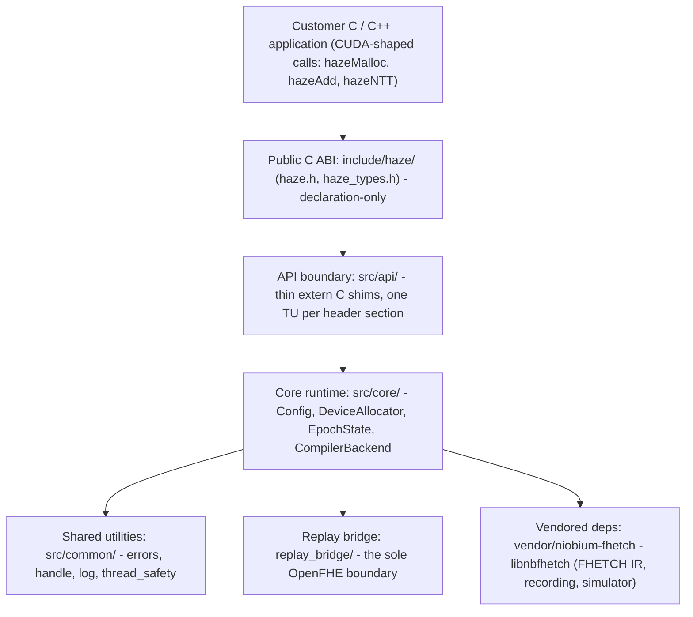
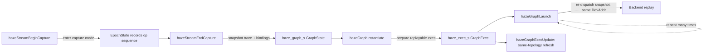

# Architecture

Haze (`libhaze`) is a C++23 record-and-replay runtime that exposes a CUDA-shaped,
stable C ABI for driving the Niobium Mistic FHE accelerator. Library authors call
`hazeMalloc` / `hazeMemcpy` / `hazeAdd` / `hazeNTT` the same way they would call the
corresponding CUDA runtime entry points; each call records one unoptimized FHETCH
Polynomial IR operation rather than executing anything at its call site. Haze sits one
layer below [`niobium-client`](https://github.com/NiobiumInc/niobium-client): where
`niobium-client` integrates at OpenFHE's `EvalAdd` / `EvalMult` boundary, Haze
integrates at the polynomial level (`NTT`, `Add`, `Mul`, `Automorph`, `BasisConvert`).
The shape is deliberately CUDA's so that CUDA-resident FHE libraries — for example
[FIDESlib](https://github.com/CAPS-UMU/FIDESlib) — can be retargeted to Niobium
hardware with minimal porting effort. This page describes the architecture as it is
built; the reasoning behind each design choice lives in
[`./decision-log.md`](./decision-log.md).

## Layered structure

Haze is organized as a strict, downward-only dependency stack. The public C ABI is
declaration-only at the top; each layer depends only on the layers beneath it, and
OpenFHE is confined to a single boundary near the bottom.

### Public C ABI (`include/haze/`)

The public surface is two headers — [`haze.h`](../include/haze/haze.h) (function
declarations) and `haze_types.h` (types) — and contains no C++ in its interface. It
exposes opaque handle types (`hazeStream_t`, `hazeEvent_t`, `hazeGraph_t`,
`hazeGraphExec_t`) as distinct pointer types rather than `void*`, the `hazeError_t`
return-code enum, and the CRT basis-convert parameter structs. Every entry point is
marked `HAZE_API` (public visibility) and `HAZE_NOEXCEPT` (no exception crosses the
boundary). The ABI is stable and frozen: no public symbol is removed, reordered, or
renamed, and `hazeError_t` values and existing struct layouts do not change.

### API boundary (`src/api/`)

`src/api/` holds one translation unit per section of the public header — `compute`,
`memory`, `config`, `device`, `stream`, `lifecycle`, `error`, `basis_convert`, and
`graph`. Each entry point is a thin `extern "C"` shim that validates its C arguments
(null and zero-length checks first), translates `void*` operands to and from the
strongly-typed `DevAddr`, delegates to a `haze::` core function, and converts the
core's `std::expected` result into an `hazeError_t`. The shim contains every C++
exception inside its own frame and updates the thread-local last-error register that
`hazeGetLastError()` reads and clears.

### Core runtime (`src/core/`)

The core holds the implementation as a small set of singletons reachable through
accessors: `haze::config()` (`Config`), `haze::allocator()` (`DeviceAllocator`),
`haze::epoch()` ([`EpochState`](../src/core/epoch.hpp)), and `haze::backend()`
(`CompilerBackend`). Typed, fallible core operations return
`std::expected<T, haze::HazeInternalError>` and are `noexcept`; failures propagate in
the value channel rather than through exceptions. This is where recording, allocation
bookkeeping, and replay dispatch happen.

### Shared utilities (`src/common/`)

`src/common/` provides the leaf utilities every layer above can use:

- [`errors.{hpp,cpp}`](../src/common/errors.hpp) — the internal `HazeInternalError`
  classification (eighteen variants) and the exhaustive `to_public_error` switch that
  maps it to the public `hazeError_t`.
- `handle.hpp` — the `DevAddr` strong type (`enum class : uintptr_t`) and
  `kHbmBase = 0x4000000000` (256 GiB), the virtual HBM base that keeps Haze-allocated
  addresses above FHETCH's synthetic address range.
- [`log.{hpp,cpp}`](../src/common/log.hpp) — the tagged `haze::log_error` sink,
  extended with structured logging and correlation IDs keyed to the epoch and stream
  (see [`./observability/README.md`](./observability/README.md)).
- [`thread_safety.hpp`](../src/common/thread_safety.hpp) — the Clang
  thread-safety-analysis macros (`HAZE_GUARDED_BY`, `HAZE_REQUIRES`, `HAZE_EXCLUDES`)
  and the `HazeMutex` / `HazeLockGuard` annotated wrappers.

### Replay bridge (`replay_bridge/`)

`replay_bridge/` is the single boundary at which OpenFHE is used. It is a
separately-built helper exposing a small pure C ABI —
`hazeReplayBridgeInitCryptoContext`, `hazeReplayBridgeReset`, and
`hazeReplayBridgeTakeHookHadError` — that synthesizes the cryptocontext and per-output
ciphertext templates the compiler-side replay consumes. Keeping it in its own target
holds OpenFHE includes out of `libhaze`'s translation units and out of downstream
consumers, so `libhaze` itself stays FHETCH-only.

### Vendored dependencies (`vendor/`)

`vendor/niobium-fhetch` (the `libnbfhetch` submodule) supplies the FHETCH Polynomial IR
instruction set, the recording session API, the `.fhetch` trace format, and the
in-process simulator; `libhaze` delegates all recording to it through
`niobium::compiler()`. It carries its own nested OpenFHE submodule. From Haze's
perspective `vendor/` is read-only: its public headers are consumable, but its sources
are out of scope.

## The lazy record-and-replay execution model

The central design of Haze is that public operations record work rather than execute
it, and a single call materializes results. See [`../CLAUDE.md`](../CLAUDE.md) for the
working-notes treatment; this section is the reference summary.

### Recording

Each public operation — `hazeMalloc`, `hazeMemcpy`, `hazeAdd`, `hazeMul`, `hazeNTT`,
`hazeAutomorph`, `hazeBasisConvert`, and the rest — does not compute at its call site.
A compute call runs through an `EpochSession` RAII guard that brings up the backend on
first use (a lock-free fast path), acquires the `EpochState` mutex and starts FHETCH
recording if it is not already active, resolves each `void*` operand to its FHETCH
`Polynomial` binding (promoting a shadow byte buffer at that address to a fresh input on
first reference), and appends one FHETCH Polynomial IR instruction to the current
epoch's trace. No hardware, simulator, or polynomial math runs during recording — the
phase only grows the trace.

### Flush: the sole materialization trigger

`hazeTagOutput(dev_ptr)` declares which recorded results must be kept; output-hood is
never inferred from a value having been computed. `hazeFlush()` is the sole trigger
that materializes anything. It calls `EpochState::replay_and_populate()`, which tags the
declared outputs (and their MRP groups), writes the per-epoch `.fhetch` trace via
`CompilerBackend::stop_epoch()`, dispatches replay through `CompilerBackend::replay()`,
reads each tagged output back with `niobium::fhetch::result(...)`, and writes the
returned bytes into the allocator's sparse shadow storage. A subsequent
`hazeMemcpy(..., HAZE_MEMCPY_DEVICE_TO_HOST)` is then a pure shadow read. A
device-to-host read of an address that was never tagged and flushed returns
`HAZE_ERROR_NOT_FLUSHED`.

### Intentional no-ops

Three entry points exist for CUDA-shape parity and are no-ops by design; they are not
incomplete and are not scheduled for implementation:

- `hazeStreamSynchronize`
- `hazeStreamWaitEvent`
- `hazeDeviceSynchronize`

Nothing runs asynchronously in the record-and-replay model, so there is no device work
to wait for and no stream-relative ordering to model. These functions return
`HAZE_SUCCESS` without side effects; in particular, `hazeDeviceSynchronize` does not
flush — `hazeFlush` is the only flush trigger.

### Two replay tiers, one trace format

The recorded `.fhetch` trace has a single format that both replay tiers consume:

- The `local` target (default) runs the trace through the in-process FHETCH simulator
  inside `libnbfhetch`, with no external binary and no transport.
- The compiler-side targets — `FUNC_SIM`, `FHE_SIM`, `FPGA_TRI`, `fhetch_sim` — ship the
  same trace over HTTP to a running `nbcc_fhetch_replay` instance, which exercises the
  Niobium compilation pipeline and either simulates or executes on hardware.

Switching tiers is a single `hazeSetTarget(...)` call (or the `HAZE_TARGET` environment
variable); application code does not change.

### Shadow storage model

`DeviceAllocator` keeps two `DevAddr`-keyed structures, so address liveness is distinct
from byte contents:

- `alloc_set_` — membership covering the `hazeMalloc` / `hazeFree` lifetime contract.
  The allocation size is implicit: every allocation equals the configured polynomial
  size, `ring_dim * sizeof(uint64_t)`.
- `shadow_data_` — the sparse byte payload. An entry exists only when the address
  carries user-written or materialized bytes; host-to-device copies, memset,
  device-to-device copies, and replay population create entries, while promoting bytes
  to a FHETCH input and `hazeFree` evict them. A read from a missing entry returns
  `HAZE_ERROR_NOT_FLUSHED` on the device-to-host path or `HAZE_ERROR_SOURCE_UNAVAILABLE`
  on the compute / device-to-device path.

`hazeSetRingDimension` must be called before the first `hazeMalloc`, and only
configured-size polynomial allocations go through `hazeMalloc`; non-polynomial scratch
uses `hazeHostAlloc` or ordinary host allocation. `hazeMallocMrp` / `hazeFreeMrp` batch
a multi-residue group under a single lock acquisition and roll back on partial failure.

## Concurrency, errors, and symbol isolation

### Lock order

Haze holds a strict `epoch -> allocator` lock order: code holding `EpochState::mutex_`
may call into `DeviceAllocator`, but the reverse is forbidden — allocator-side code must
never call back into `EpochState` while holding a lock, or it will deadlock. The
constraint is enforced both architecturally (no such back-call exists in source) and by
Clang thread-safety analysis under `-Wthread-safety`, which checks the per-mutex
`HAZE_REQUIRES` / `HAZE_EXCLUDES` contracts at compile time. New locks use the annotated
`HazeMutex` / `HazeLockGuard` wrappers because libstdc++'s `std::mutex` and
`std::lock_guard` carry no thread-safety capability annotations. The full locking and
thread-safety contract is documented in [`../style.md`](../style.md), and the macros
live in [`../src/common/thread_safety.hpp`](../src/common/thread_safety.hpp).

### Error model

Internally, fallible functions return `std::expected<T, HazeInternalError>` and
propagate errors in the value channel. At the C ABI boundary, `set_internal_result` and
`to_public_error` translate the internal classification to a public `hazeError_t`, and
no C++ exception ever crosses the boundary. Only user-actionable conditions get their
own code; anything signaling that Haze itself is broken maps to `HAZE_ERROR_INTERNAL`.

| Code | Value | Meaning |
|------|-------|---------|
| `HAZE_SUCCESS` | 0 | operation succeeded |
| `HAZE_ERROR_INVALID_VALUE` | 1 | argument violated the documented contract |
| `HAZE_ERROR_OUT_OF_MEMORY` | 2 | allocator could not satisfy the request |
| `HAZE_ERROR_NOT_SUPPORTED` | 3 | operation is not implemented for this build / target |
| `HAZE_ERROR_CONFIGERR` | 4 | ring dimension / modulus / target not configured |
| `HAZE_ERROR_UNKNOWN_ADDRESS` | 5 | `DevAddr` not in the allocator's table |
| `HAZE_ERROR_NO_DATA` | 6 | address allocated but never written |
| `HAZE_ERROR_ALLOC_TOO_SMALL` | 7 | allocation size is smaller than the polynomial size |
| `HAZE_ERROR_SOURCE_UNAVAILABLE` | 8 | compute / device-to-device source has no shadow data |
| `HAZE_ERROR_NOT_FLUSHED` | 9 | device-to-host read of an untagged / unflushed address |
| `HAZE_ERROR_INTERNAL` | 1024 | a Haze invariant broke or the backend failed |

The last failure is recorded in a thread-local `g_last_error` register that
`hazeGetLastError()` reads and clears. The richer internal classification is available in
the `HAZE_DEBUG=1` stderr log.

### Symbol isolation

`libhaze` exports only the `haze*` C ABI. A linker version script plus `--exclude-libs`
localizes everything else: internal C++ symbols mangle to `_ZN4haze...` and are hidden,
and the statically-absorbed NiobiumFhetch and OpenFHE object code is prevented from
re-exporting its symbols, avoiding collisions in downstream links. The guarantee is
audited by [`../scripts/check_symbol_leak.sh`](../scripts/check_symbol_leak.sh), which
fails the build if `libhaze` exports any defined dynamic symbol outside the `haze*` ABI.

## Graph capture: record-once, replay-many

Graph capture layers a snapshot-and-replay pattern on top of the epoch recording model,
mirroring CUDA's stream-capture / `cudaGraphInstantiate` / `cudaGraphLaunch` semantics.
`hazeStreamBeginCapture` enters capture mode, during which recorded operations
accumulate as usual. `hazeStreamEndCapture` snapshots the recorded FHETCH op sequence
together with its input bindings into a `haze_graph_s` graph object, backed by the core
module `src/core/graph.{hpp,cpp}`. `hazeGraphInstantiate` prepares a replayable
`haze_exec_s` executable from that snapshot; `hazeGraphLaunch` re-dispatches the snapshot,
producing identical results on each launch; and `hazeGraphExecUpdate` refreshes a
same-topology executable in place. The correctness invariant is `DevAddr` operand
stability — the same device addresses must back the operands across every replay. The
rationale for snapshotting the epoch trace rather than introducing a new IR is recorded
in [`./decision-log.md`](./decision-log.md).

## See also

- [`./index.md`](./index.md) — documentation landing page
- [`./building.md`](./building.md) — build instructions and toolchain
- [`./testing.md`](./testing.md) — testing guide and suites
- [`./decision-log.md`](./decision-log.md) — design decisions, rationale, and traceability
- [`./observability/README.md`](./observability/README.md) — logging, counters, and dashboard template
- [`../README.md`](../README.md) — project overview and quickstart
