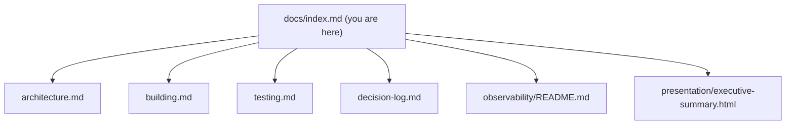

# Haze Documentation

Haze (`libhaze`) is a C++23 record-and-replay runtime that exposes a
CUDA-shaped, stable C ABI for driving the Niobium Mistic FHE accelerator.
Library authors write `hazeMalloc` / `hazeMemcpy` / `hazeAdd` / `hazeNTT` the
same way they would write the corresponding CUDA runtime calls, and Haze records
each one as an unoptimized FHETCH Polynomial IR trace that is executed locally
for validation or shipped to the Niobium compilation service for optimization
and deployment to hardware. This page is the landing point for the topic guides
under `docs/`; the root [`README.md`](../README.md) remains the fastest way in.

## Documentation

The diagram below maps this documentation tree; each page is linked with a
one-line summary beneath it.

- [`Architecture`](./architecture.md) — the layered API / core / common design,
  the lazy record-and-replay execution model, the replay-bridge boundary, and
  graph capture.
- [`Building`](./building.md) — prerequisites and the standalone, submodule, and
  nix build flows, plus the live `make bench` and `make coverage` targets and
  CMake option knobs (including the `HAZE_COVERAGE` coverage-instrumentation
  option).
- [`Testing`](./testing.md) — the Catch2 suites and tags, the CTest targets, and
  sanitizer builds (`HAZE_SANITIZERS`/`HAZE_TSAN`). The 80% line-coverage gate on
  `src/core/` and `src/api/` is wired and enforced in CI, currently passing at
  85.70%.
- [`Decision Log`](./decision-log.md) — the Explainability rationale for every
  non-trivial decision and the bidirectional traceability matrix (Rule 1); it is
  the single source of truth for why a choice was made.
- [`Observability`](./observability/README.md) — structured logging with
  correlation IDs, the performance-counters "metrics endpoint", op/epoch
  tracing, health and readiness introspection, and the dashboard template
  (Rule 2).
- [`Executive Summary`](./presentation/executive-summary.html) — a
  self-contained reveal.js deck summarizing the initiative for leadership
  (Rule 3).

## Project links

- [`README.md`](../README.md) — the project overview and quickstart.
- [`examples/`](../examples/) — the runnable `quickstart.c` (pure C) and
  decrypt-verified `ckks22.cpp` (C++), byte-for-byte mirrors of the two fenced
  examples in the README.
- [`CONTRIBUTING.md`](../CONTRIBUTING.md) — the contribution workflow, quality
  gates, architectural invariants, and the CLA placeholder.

The root `README.md` remains the primary overview and the source of truth for
the runnable examples that CI extracts and gates; the pages in this tree provide
deeper, topic-focused guides.
