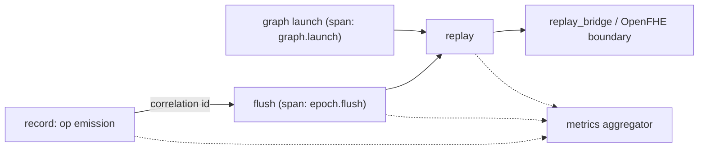

# Haze Observability

This directory documents how Haze (libhaze) satisfies the **Observability** requirement and provides the dashboard template for the runtime performance counters.

Haze is a **C++ shared library with a C ABI** — a record-and-replay runtime shim for the Niobium FHE accelerator — **not a network service**. The Observability requirement is written for long-running networked services (log aggregation, a scrape-able metrics endpoint, cross-service trace propagation, HTTP health probes). It is therefore **reinterpreted for the library context**: each service-oriented pillar is mapped onto the equivalent in-process surface a linked application can consume. This reinterpretation is a deliberate, recorded deviation; its rationale lives in the decision log, [`../decision-log.md`](../decision-log.md), which is the single source of truth for design rationale. This page documents *what* the surfaces are and *where* they live, not *why* the reinterpretation was chosen.

## Observability surfaces at a glance

| Pillar (service form) | Haze library form | Primary location |
| --- | --- | --- |
| Structured logging with correlation IDs | Tagged log sink extended with structured fields and an epoch/stream correlation ID | [`../../src/common/log.hpp`](../../src/common/log.hpp), [`../../src/common/log.cpp`](../../src/common/log.cpp) |
| Metrics endpoint | The `hazeGetPerformanceCounters` query surface backed by the `hazePerformanceCounters` struct | [`../../include/haze/haze_types.h`](../../include/haze/haze_types.h), [`../../src/core/metrics.hpp`](../../src/core/metrics.hpp) |
| Distributed tracing across service boundaries | Epoch/graph span tracing across the record to flush to replay path, gated by `HAZE_TRACE` | [`../../src/core/epoch.cpp`](../../src/core/epoch.cpp), [`../../src/core/graph.cpp`](../../src/core/graph.cpp) |
| Health and readiness checks | The `haze::runtime_readiness()` query over lifecycle and configuration state | [`../../src/common/log.hpp`](../../src/common/log.hpp) (declaration), [`../../src/core/epoch.cpp`](../../src/core/epoch.cpp) (definition) |
| Dashboard template | Grafana-style JSON template over the performance counters | [`./dashboard-template.json`](./dashboard-template.json) |

## Structured logging and correlation IDs

Haze's log surface is a single tagged sink, `haze::log_error(tag, body)`. The Observability work **is wired**: the sink now emits lines of the form `[haze] [cid=<id>] <tag>: <body>` in one line-atomic `std::fwrite` to `stderr`, where `<id>` is the current thread-local **correlation ID** (0 when unset). Correlation IDs are installed per runtime operation via an RAII `CorrelationScope` seeded from `next_correlation_id()` (monotonic, never 0), so every diagnostic emitted while flushing or replaying a given epoch — or launching a graph — shares one ID and can be correlated end to end. Existing call sites remain **source-compatible** — the no-argument `log_error(tag, body)` overload stamps the current thread-local ID automatically, so no caller has to change.

Two confidentiality/integrity properties are enforced at emission time:

- **Path redaction.** Body fields are passed through `redact_paths`, which replaces the directory portion of any on-disk path with `<redacted>/` and keeps only the basename, so host filesystem layout (and temp-dir names holding FHE material) is not disclosed.
- **Field escaping.** Tag and body are passed through `append_escaped`, which renders every newline, C0/C1 control byte, DEL, and non-ASCII byte as a printable `\xNN` escape, so no field can inject a framing break and records never interleave.

On any formatting or write failure the `noexcept` sink emits a fixed, allocation-free dropped-record notice rather than re-emitting the record, so no exception crosses the C ABI. See [`../../src/common/log.hpp`](../../src/common/log.hpp) for the sink declaration and [`../decision-log.md`](../decision-log.md) (D-16, D-28) for the rationale.

## Metrics: the `hazeGetPerformanceCounters` surface

Because Haze cannot expose an HTTP `/metrics` endpoint, the "metrics endpoint" is the **public query function** `hazeGetPerformanceCounters(void *counters)`, which fills a caller-provided `hazePerformanceCounters` struct. The struct is **strictly additive** to the C ABI (no existing symbol, enum value, or struct layout changes). All values are **cumulative** since process start or the most recent `hazeDeviceReset()`; byte counts are in bytes and flush timings are in nanoseconds.

The aggregator in [`../../src/core/metrics.hpp`](../../src/core/metrics.hpp) collects the counters through read-only hooks along the existing record-and-replay path; it does not alter the data path itself.

| Counter field | Meaning | Fed by |
| --- | --- | --- |
| `op_count` | High-level ops emitted, counted **once per op** regardless of SRP/MRP residue fan-out; device-to-device copies are **not** counted here | Compute op shims [`../../src/core/compute.hpp`](../../src/core/compute.hpp) (add/mul/NTT/automorph, SRP + MRP) and basis-convert [`../../src/core/basis_convert.cpp`](../../src/core/basis_convert.cpp) |
| `bytes_h2d` | Cumulative host-to-device bytes moved | Allocator copy hooks, [`../../src/core/allocator.cpp`](../../src/core/allocator.cpp) |
| `bytes_d2h` | Cumulative device-to-host bytes moved | Allocator copy hooks, [`../../src/core/allocator.cpp`](../../src/core/allocator.cpp) |
| `bytes_d2d` | Cumulative device-to-device bytes moved, charged **after a copy succeeds** (SRP and MRP, the latter via the residue count) | Device-to-device memcpy hooks, [`../../src/core/epoch.cpp`](../../src/core/epoch.cpp) |
| `flush_count` | Number of `hazeFlush()` replay invocations | Epoch flush, [`../../src/core/epoch.cpp`](../../src/core/epoch.cpp) |
| `flush_time_ns_total` | Cumulative flush/replay wall time (nanoseconds) | Epoch flush timing, [`../../src/core/epoch.cpp`](../../src/core/epoch.cpp) |
| `flush_time_ns_last` | Most-recent flush/replay wall time (nanoseconds) | Epoch flush timing, [`../../src/core/epoch.cpp`](../../src/core/epoch.cpp) |

The three byte counters correspond one-to-one to `hazeMemcpyKind` (`HOST_TO_DEVICE`, `DEVICE_TO_HOST`, `DEVICE_TO_DEVICE`). All seven counters are plain `uint64_t` guarded by a single leaf mutex; every mutator, `snapshot()`, and `reset()` takes that lock, so a `hazeGetPerformanceCounters` snapshot never observes a torn read and a `hazeDeviceReset` clears all seven as one indivisible step. Adds **saturate** at `UINT64_MAX` rather than wrapping (a silent wrap would look like a false regression). The struct definition is in [`../../include/haze/haze_types.h`](../../include/haze/haze_types.h); the consistency/overflow/quiescence policy is documented in [`../../src/core/metrics.hpp`](../../src/core/metrics.hpp) and [`../decision-log.md`](../decision-log.md) (D-25).

## Tracing: op and epoch spans

"Distributed tracing across service boundaries" is reinterpreted as **span tracing** across the in-process record to flush to replay path. Each traced runtime operation is bracketed by an RAII `TraceSpan` under a fresh `CorrelationScope`, so the span's begin/end pair and every diagnostic inside it share one correlation ID. Three coarse spans are emitted today (one begin/end pair each):

- `epoch.flush` — the `hazeFlush()` finalize → replay → populate cycle ([`../../src/core/epoch.cpp`](../../src/core/epoch.cpp)), which is also where the crossing into the `replay_bridge/` OpenFHE isolation layer happens.
- `epoch.write_program` — the record-to-disk path for a captured program ([`../../src/core/epoch.cpp`](../../src/core/epoch.cpp)).
- `graph.launch` — each replay of an instantiated captured graph ([`../../src/core/graph.cpp`](../../src/core/graph.cpp)).

Span emission is **gated by the `HAZE_TRACE` environment variable**, re-read on each span (see [`../decision-log.md`](../decision-log.md), D-27), so tracing is off by default and can be toggled at runtime — including in-process by a test that drives a real flush and captures the begin/end records. When `HAZE_TRACE` is unset, spans are suppressed but error diagnostics still flow through `log_error` with their correlation ID.

## Health and readiness

Service health probes are reinterpreted as **lifecycle and configuration-state introspection**, exposed as a concrete `haze::runtime_readiness()` query (declared in [`../../src/common/log.hpp`](../../src/common/log.hpp), defined in [`../../src/core/epoch.cpp`](../../src/core/epoch.cpp)). It returns a `RuntimeReadiness` struct reporting whether a device is configured, whether the backend is initialized, and whether an epoch is currently recording. Each sub-state is read under its own leaf lock with **no lock nesting** (see [`../decision-log.md`](../decision-log.md), D-29), so the query introduces no new lock-ordering edge; it is advisory, point-in-time introspection rather than a transactional guarantee. This is an internal `haze::` surface — it adds no new exported C ABI symbol, preserving the symbol-leak audit.

## The dashboard template

[`./dashboard-template.json`](./dashboard-template.json) is a self-describing, Grafana-style dashboard **template** over the performance counters. It declares a placeholder datasource (`${DS_HAZE}`) and one time series or stat panel per counter, with metric names of the form `haze_<field>` that match the `hazePerformanceCounters` fields exactly:

- **Op Count** — `haze_op_count`, with an optional per-op-type breakdown driven by a templated `op_type` variable (add, mul, NTT, automorph, basis-convert). The struct exposes a single aggregate `op_count`; the per-op-type split is a dashboard-side label dimension, not a separate ABI field.
- **Bytes Moved by Direction** — `haze_bytes_h2d`, `haze_bytes_d2h`, `haze_bytes_d2d` (unit: bytes).
- **Flush Count** — `haze_flush_count`.
- **Flush Time (Cumulative / Last)** — `haze_flush_time_ns_total` and `haze_flush_time_ns_last` (unit: nanoseconds).

Point the template's datasource at whatever exporter publishes the counters, then adapt the metric namespace to that exporter.

## Not instrumented: the three documented no-ops

The three documented no-op entry points — `hazeStreamSynchronize`, `hazeStreamWaitEvent`, and `hazeDeviceSynchronize` — are **correct by design** and remain **pure and uninstrumented**. They emit no logs, no counters, and no spans, and this work does not change that.

## See also

- [Documentation index](../index.md)
- [Architecture overview](../architecture.md)
- [Decision log](../decision-log.md) — rationale for the library-context reinterpretation
- [Project README](../../README.md)
