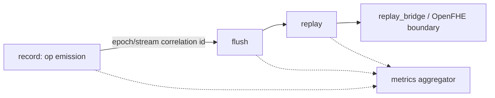

# Haze Observability

This directory documents how Haze (libhaze) satisfies the **Observability** requirement and provides the dashboard template for the runtime performance counters.

Haze is a **C++ shared library with a C ABI** — a record-and-replay runtime shim for the Niobium FHE accelerator — **not a network service**. The Observability requirement is written for long-running networked services (log aggregation, a scrape-able metrics endpoint, cross-service trace propagation, HTTP health probes). It is therefore **reinterpreted for the library context**: each service-oriented pillar is mapped onto the equivalent in-process surface a linked application can consume. This reinterpretation is a deliberate, recorded deviation; its rationale lives in the decision log, [`../decision-log.md`](../decision-log.md), which is the single source of truth for design rationale. This page documents *what* the surfaces are and *where* they live, not *why* the reinterpretation was chosen.

## Observability surfaces at a glance

| Pillar (service form) | Haze library form | Primary location |
| --- | --- | --- |
| Structured logging with correlation IDs | Tagged log sink extended with structured fields and an epoch/stream correlation ID | [`../../src/common/log.hpp`](../../src/common/log.hpp), [`../../src/common/log.cpp`](../../src/common/log.cpp) |
| Metrics endpoint | The `hazeGetPerformanceCounters` query surface backed by the `hazePerformanceCounters` struct | [`../../include/haze/haze_types.h`](../../include/haze/haze_types.h), [`../../src/core/metrics.hpp`](../../src/core/metrics.hpp) |
| Distributed tracing across service boundaries | Op/epoch span tracing across the record to flush to replay path and the `replay_bridge/` OpenFHE boundary | [`../../src/core/epoch.cpp`](../../src/core/epoch.cpp) |
| Health and readiness checks | Lifecycle and configuration-state introspection | [`../architecture.md`](../architecture.md) |
| Dashboard template | Grafana-style JSON template over the performance counters | [`./dashboard-template.json`](./dashboard-template.json) |

## Structured logging and correlation IDs

Haze's existing log surface is a single tagged sink, `haze::log_error(tag, body)`, which writes lines of the form `[haze] <tag>: <body>` to `std::cerr`. The Observability work **extends** this sink with structured fields and a **correlation ID keyed by epoch and stream**, so that log lines emitted while recording, flushing, and replaying a given epoch can be correlated. Existing call sites remain **source-compatible** — no caller has to change to keep working.

See [`../../src/common/log.hpp`](../../src/common/log.hpp) for the sink declaration.

## Metrics: the `hazeGetPerformanceCounters` surface

Because Haze cannot expose an HTTP `/metrics` endpoint, the "metrics endpoint" is the **public query function** `hazeGetPerformanceCounters(void *counters)`, which fills a caller-provided `hazePerformanceCounters` struct. The struct is **strictly additive** to the C ABI (no existing symbol, enum value, or struct layout changes). All values are **cumulative** since process start or the most recent `hazeDeviceReset()`; byte counts are in bytes and flush timings are in nanoseconds.

The aggregator in [`../../src/core/metrics.hpp`](../../src/core/metrics.hpp) collects the counters through read-only hooks along the existing record-and-replay path; it does not alter the data path itself.

| Counter field | Meaning | Fed by |
| --- | --- | --- |
| `op_count` | Total FHETCH ops emitted (SRP + MRP + basis-convert) | Epoch op emission, [`../../src/core/epoch.cpp`](../../src/core/epoch.cpp) |
| `bytes_h2d` | Cumulative host-to-device bytes moved | Allocator copy hooks, [`../../src/core/allocator.cpp`](../../src/core/allocator.cpp) |
| `bytes_d2h` | Cumulative device-to-host bytes moved | Allocator copy hooks, [`../../src/core/allocator.cpp`](../../src/core/allocator.cpp) |
| `bytes_d2d` | Cumulative device-to-device bytes moved | Memcpy hooks |
| `flush_count` | Number of `hazeFlush()` replay invocations | Epoch flush, [`../../src/core/epoch.cpp`](../../src/core/epoch.cpp) |
| `flush_time_ns_total` | Cumulative flush/replay wall time (nanoseconds) | Epoch flush timing, [`../../src/core/epoch.cpp`](../../src/core/epoch.cpp) |
| `flush_time_ns_last` | Most-recent flush/replay wall time (nanoseconds) | Epoch flush timing, [`../../src/core/epoch.cpp`](../../src/core/epoch.cpp) |

The three byte counters correspond one-to-one to `hazeMemcpyKind` (`HOST_TO_DEVICE`, `DEVICE_TO_HOST`, `DEVICE_TO_DEVICE`). The struct definition is in [`../../include/haze/haze_types.h`](../../include/haze/haze_types.h).

## Tracing: op and epoch spans

"Distributed tracing across service boundaries" is reinterpreted as **op/epoch span tracing** across the in-process record to flush to replay path and across the one external boundary Haze has — the `replay_bridge/` OpenFHE isolation layer. A correlation ID identifies the epoch/stream; spans bracket op emission, flush/replay, and the bridge crossing.

## Health and readiness

Service health probes are reinterpreted as **lifecycle and configuration-state introspection**: is a device configured, is the backend initialized, is an epoch active? These states are observable through the lifecycle and configuration surfaces described in [`../architecture.md`](../architecture.md).

## The dashboard template

[`./dashboard-template.json`](./dashboard-template.json) is a self-describing, Grafana-style dashboard **template** over the performance counters. It declares a placeholder datasource (`${DS_HAZE}`) and one time series or stat panel per counter, with metric names of the form `haze_<field>` that match the `hazePerformanceCounters` fields exactly:

- **Op Count** — `haze_op_count`, with an optional per-op-type breakdown driven by a templated `op_type` variable (add, mul, NTT, automorph, basis-convert). The struct exposes a single aggregate `op_count`; the per-op-type split is a dashboard-side label dimension, not a separate ABI field.
- **Bytes Moved by Direction** — `haze_bytes_h2d`, `haze_bytes_d2h`, `haze_bytes_d2d` (unit: bytes).
- **Flush Count** — `haze_flush_count`.
- **Flush Time (Cumulative / Last)** — `haze_flush_time_ns_total` and `haze_flush_time_ns_last` (unit: nanoseconds).

Point the template's datasource at whatever exporter publishes the counters, then adapt the metric namespace to that exporter.

## Not instrumented: the three documented no-ops

The three documented no-op entry points — `hazeStreamSynchronize`, `hazeStreamWaitEvent`, and `hazeDeviceSynchronize` — are **correct by design** and remain **pure and uninstrumented**. They emit no logs, no counters, and no spans, and this work does not change that.

## See also

- [Documentation index](../index.md)
- [Architecture overview](../architecture.md)
- [Decision log](../decision-log.md) — rationale for the library-context reinterpretation
- [Project README](../../README.md)
